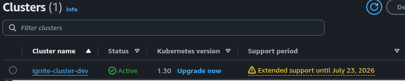
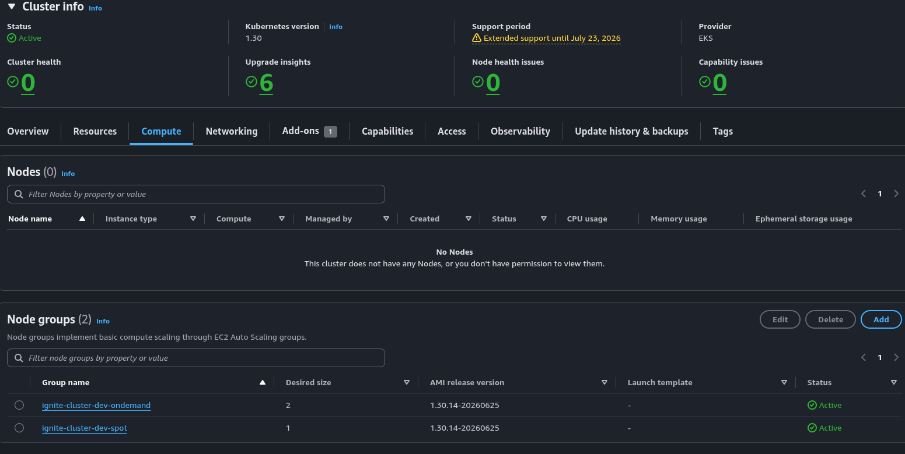
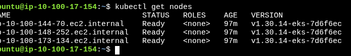
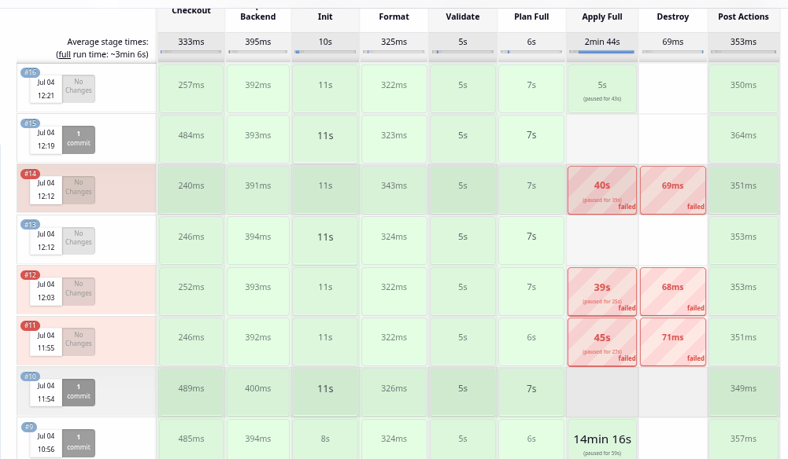

## EKS Infrastructure with Terraform

Production-style Kubernetes infrastructure on AWS using Terraform, designed to be modular, reproducible, and environment-agnostic.

This project demonstrates Infrastructure as Code, Kubernetes platform provisioning, and cloud networking design aligned with DevOps best practices.

---
### What This Project Demonstrates

* Infrastructure as Code using Terraform
* Kubernetes platform provisioning on AWS
* Cloud networking design (VPC/subnets/routing)
* IAM role configuration for managed services
* Reusable infrastructure modules
* Cluster scalability design (scalable from 3–8 nodes)

### Features

*  Separate environments (`dev`, `prod`)
*  Modular Terraform structure (`vpc`, `iam`, `eks`)
*  Multi-AZ Subnet distribution
*  Public/private subnet architecture
*  Single NAT Gateway (Cost-optimized for Dev; upgrade to Multi-NAT for Prod)
*  Spot and On-Demand node groups for cost optimization
*  Secure EKS cluster (private API access)
*  OIDC provider created by the EKS module, with IRSA role support via the IAM module
*  Configurable EKS add-ons
*  CI/CD ready with Jenkins pipeline for safe plan/apply/destroy
*  Remote S3 backend currently using deprecated DynamoDB-based locking; native S3 lockfiles are recommended for future implementation

---

### Proof of Successful Deployment

| Check | Evidence |
|------|----------|
| EKS cluster active |  |
| Managed node groups active |  |
| Nodes visible through kubectl |  |
| Jenkins pipeline completed |  |

---

### Architecture Overview

      ┌─────────────────────────────────────────────────────────────────────────────┐
      │                              AWS CLOUD (us-east-1)                          │
      │                                                                             │
      │  ┌───────────────────────────────────────────────────────────────────────┐  │
      │  │                         VPC (10.x.0.0/16)                             │  │
      │  │                                                                       │  │
      │  │  ┌──────────────────┐         ┌────────────────────────────────────┐  │  │
      │  │  │  Public Subnets  │         │       Private Subnets              │  │  │
      │  │  │  (3 AZs)         │         │         (3 AZs)                    │  │  │
      │  │  │                  │         │                                    │  │  │
      │  │  │  ┌────────────┐  │         │  ┌──────────────────────────────┐  │  │  │
      │  │  │  │ Internet   │  │         │  │      EKS Cluster             │  │  │  │
      │  │  │  │  Gateway   │  │         │  │  ┌──────────────────────┐    │  │  │  │
      │  │  │  └─────┬──────┘  │         │  │  │   Control Plane      │    │  │  │  │
      │  │  │        │         │         │  │  │   (Private API)      │    │  │  │  │
      │  │  │  ┌─────▼──────┐  │         │  │  └──────────┬───────────┘    │  │  │  │
      │  │  │  │ NAT Gateway│  │         │  │             │                │  │  │  │
      │  │  │  └────────────┘  │         │  │  ┌──────────▼───────────┐    │  │  │  │
      │  │  │                  │         │  │  │   Node Groups        │    │  │  │  │
      │  │  │  ┌────────────┐  │         │  │  │  • On-Demand         │    │  │  │  │
      │  │  │  │ Route Table│  │         │  │  │  • Spot              │    │  │  │  │
      │  │  │  └────────────┘  │         │  │  └──────────────────────┘    │  │  │  │
      │  │  └──────────────────┘         └────────────────────────────────────┘  │  |
      │  └───────────────────────────────────────────────────────────────────────┘  │
      │                                                                             │
      │  ┌──────────────────────────┐  ┌────────────────────────────────────────┐   │
      │  │      IAM Roles           │  │         State Backend                  │   │
      │  │  • Control Plane         │  │  • S3 (terraform.tfstate)              │   │
      │  │  • Node Groups           │  │  • DynamoDB locking (deprecated)       │   │
      │  │  • OIDC/IRSA             │  │                                        │   │
      │  └──────────────────────────┘  └────────────────────────────────────────┘   │
      └─────────────────────────────────────────────────────────────────────────────┘
                          ^                                  ^
                          │                                  │
               ┌──────────┴──────────┐             ┌─────────┴─────────┐
               │   Jenkins Pipeline  │             │  Jumpserver       │
               │   (Plan→Apply)      │             │   (kubectl)       │
               └──────────┬──────────┘             └─────────┬─────────┘
                          │                                    │
                          └────────────┬───────────────────────┘
                                       │
                               ┌───────▼───────┐
                               │ Git Repository│
                               │ (Terraform)   │
                               └───────────────┘


### Terraform Module Overview
      ┌─────────────────────┬───────────────────────────────────────────────────────┐
      │      MODULE         │              WHAT IT BUILDS                           │
      ├─────────────────────┼───────────────────────────────────────────────────────┤
      │                     │                                                       │
      │   modules/vpc/      │  Networking Foundation                                │
      │                     │  • VPC (Virtual Private Cloud)                        │
      │                     │  • Public Subnets (3 AZs)                             │
      │                     │  • Private Subnets (3 AZs)                            │
      │                     │  • Internet Gateway                                   │
      │                     │  • NAT Gateway + Elastic IP                           │
      │                     │  • Route Tables (public + private)                    │
      │                     │  • Security Groups                                    │
      │                     │                                                       │
      ├─────────────────────┼───────────────────────────────────────────────────────┤
      │                     │                                                       │
      │   modules/iam/      │  Core Identity & Access Management                    │
      │                     │  • EKS Control Plane IAM Role                         │
      │                     │  • EKS Node Group IAM Role                            │
      │                     │  • Required Managed Policy Attachments                │
      │                     │                                                       │
      ├─────────────────────┼───────────────────────────────────────────────────────┤
      │                     │                                                       │
      │   modules/eks/      │  Kubernetes Platform (Consolidated)                   │
      │                     │  • EKS Cluster (Control Plane)                        │
      │                     │  • Managed Node Groups (On-Demand & Spot)             │
      │                     │  • OIDC Identity Provider & IRSA Support              │
      │                     │  • EKS Add-ons & Identity-Aware Security              │
      │                     │                                                       │
      └─────────────────────┴───────────────────────────────────────────────────────┘

---

### Prerequisites

* Terraform CLI
* AWS IAM user with appropriate permissions
* S3 bucket for remote state storage and a DynamoDB table for the current deprecated locking method
* CI/CD environment with Terraform and AWS credentials.

---

### CI Pipeline (Jenkins)

Infrastructure provisioning is automated using the root `Jenkinsfile`.
The current Jenkins pipeline uses a full Terraform plan/apply flow for the selected environment.

Pipeline parameters:

* `ENVIRONMENT`: `dev` or `prod`
* `ACTION`: `plan`, `apply`, or `destroy`

Pipeline stages and what they do:

* `Checkout`
  * Clone the repository from the configured branch.
* `Prepare Backend`
  * Copy `environments/${params.ENVIRONMENT}/backend.tf` into the repo root.
  * Ensures Terraform initializes with the correct remote state backend for the selected environment.
* `Terraform Init`
  * Run `terraform init -reconfigure` to initialize providers, modules, and backend state.
* `Terraform Format`
  * Run `terraform fmt -recursive` to normalize HCL formatting.
* `Terraform Validate`
  * Run `terraform validate` to check syntax, providers, modules, and input requirements.
* `Terraform Plan Full`
  * Create one full plan using `environments/${ENVIRONMENT}/${ENVIRONMENT}.tfvars`.
  * Save the plan as `tfplan-${ENVIRONMENT}-full`.
* `Terraform Apply Full`
  * Manual approval step, then apply the saved full plan.
* `Terraform Destroy`
  * Manual approval step, then run `terraform destroy` for the selected environment.

Before approving an apply, review the plan carefully. Do not approve a plan that unexpectedly says:

```text
module.eks.aws_eks_cluster.ignite_cluster[0] must be replaced
```

or shows an unexpected destroy of the EKS cluster, VPC, node groups, or IAM roles. For existing clusters, avoid Terraform changes that force EKS control plane replacement unless you intentionally want to rebuild.

### GitHub Actions workflow

A GitHub Actions workflow is also included in `.github/workflows/terraform.yml`.
This workflow uses targeted plan artifacts for IAM core, EKS, and IRSA, then applies those artifacts in order.

Workflow jobs:

* `validate`
  * Runs on `push`, `pull_request`, and manual dispatch.
  * Checks out the repo, configures AWS credentials, initializes Terraform, runs `terraform fmt`, and validates the configuration.
* `plan`
  * Runs on manual dispatch when `action` is `plan`.
  * Creates targeted plans for `module.iam_core`, `module.eks`, and `module.iam_irsa`.
  * Uploads plan artifacts for later apply.
* `apply`
  * Runs on manual dispatch when `action` is `apply`.
  * Downloads previously generated plan artifacts and applies the plans in order.
* `destroy`
  * Runs on manual dispatch when `action` is `destroy`.
  * Destroys the selected environment.

---

### Accessing the Cluster

The cluster endpoint is private by default. Run `kubectl` from a jump server or Jenkins host that can reach the VPC. Network access alone is not enough: the IAM user or role must also be authorized in EKS.

```bash
# Get kubeconfig on the machine that will run kubectl
aws eks update-kubeconfig --region us-east-1 --name ignite-cluster-dev

# Verify current AWS principal
aws sts get-caller-identity

# Verify Kubernetes access
kubectl get nodes
```

If `kubectl` tries to reach `http://localhost:8080`, kubeconfig is missing. Re-run `aws eks update-kubeconfig` on the jump server.

If `kubectl` says `the server has asked for the client to provide credentials`, kubeconfig exists but the IAM principal is not authorized in EKS yet.

Enable EKS access entries for the current cluster:

```bash
aws eks update-cluster-config \
  --region us-east-1 \
  --name ignite-cluster-dev \
  --access-config authenticationMode=API_AND_CONFIG_MAP
```

Grant access to your AWS console IAM user/role:

```bash
aws eks create-access-entry \
  --region us-east-1 \
  --cluster-name ignite-cluster-dev \
  --principal-arn <YOUR_IAM_USER_OR_ROLE_ARN>

aws eks associate-access-policy \
  --region us-east-1 \
  --cluster-name ignite-cluster-dev \
  --principal-arn <YOUR_IAM_USER_OR_ROLE_ARN> \
  --policy-arn arn:aws:eks::aws:cluster-access-policy/AmazonEKSClusterAdminPolicy \
  --access-scope type=cluster
```

For a jump server or Jenkins EC2 instance role, use the base IAM role ARN, not the STS assumed-role session ARN. Example:

```bash
aws eks create-access-entry \
  --region us-east-1 \
  --cluster-name ignite-cluster-dev \
  --principal-arn arn:aws:iam::495599741234:role/Jenkinsrole

aws eks associate-access-policy \
  --region us-east-1 \
  --cluster-name ignite-cluster-dev \
  --principal-arn arn:aws:iam::495599741234:role/Jenkinsrole \
  --policy-arn arn:aws:eks::aws:cluster-access-policy/AmazonEKSClusterAdminPolicy \
  --access-scope type=cluster
```

For production, replace `AmazonEKSClusterAdminPolicy` with narrower policies/roles.

---

### Folder Structure

```bash
❯ tree -aL 3
.
├── environments
│   ├── dev
│   │   ├── backend.tf
│   │   └── dev.tfvars
│   └── prod
│       ├── backend.tf
│       └── prod.tfvars
├── .gitignore
├── Jenkinsfile
├── main.tf
├── modules
│   ├── eks
│   │   ├── main.tf
│   │   ├── outputs.tf
│   │   └── variables.tf
│   ├── iam
│   │   ├── data.tf
│   │   ├── main.tf
│   │   ├── outputs.tf
│   │   └── variables.tf
│   └── vpc
│       ├── main.tf
│       ├── outputs.tf
│       └── variables.tf
├── outputs.tf
├── providers.tf
├── README.md
└── variables.tf


```
---

---

### Remote Backend Configuration

Each environment has its own backend config in `environments/<env>/backend.tf`. Copy the selected backend file to the repo root before running Terraform locally:

```bash
cp environments/dev/backend.tf ./backend.tf
```

Example S3 backend:

```hcl
terraform {
  backend "s3" {
    bucket         = "project-ignite-tfstate-YOUR-ID"
    key            = "dev/terraform.tfstate"
    region         = "us-east-1"
    dynamodb_table = "project-ignite-locks"
    encrypt        = true
  }
}
```

> **State-locking:** This project currently uses DynamoDB-based Terraform state locking. DynamoDB locking for the S3 backend is deprecated as per documentation and may be removed in a future Terraform version. Native S3 locking with `use_lockfile = true` is recommended for future implementation.

---

### Environment Variables

You can override values in `dev.tfvars` or `prod.tfvars`. Example:

```hcl
# environments/dev/dev.tfvars
infra_environment     = "dev"
infra_region          = "us-east-1"
infra_vpc_cidr        = "10.100.0.0/16"
infra_cluster_name    = "ignite-cluster-dev"
infra_enable_eks      = true
infra_cluster_version = "1.30"
...
```

---

### Per-Environment Terraform Workflow (Locally)

You can deploy or manage infrastructure for each environment (`dev`, `prod`, etc.) independently using their own backend and variable files.

> 📌 All commands should be run from the project root (`EKS-TF-infra/`)

### Steps for `dev` Environment Quick Start (local)

```bash

# Clone repo
git clone https://github.com/eliyasv/EKS-TF-infra.git
cd EKS-TF-infra
# Copy backend config
cp environments/dev/backend.tf ./backend.tf
# Initialize Terraform
terraform init
# Plan for dev(This creates an execution plan based on the dev environment variables.)
terraform plan -var-file=environments/dev/dev.tfvars -out=tfplan-dev
# Apply for dev
terraform apply tfplan-dev

```

This Terraform configuration deploys a production-ready EKS cluster named ignite-cluster-dev in the us-east-1 region. It includes:

* An EKS cluster running Kubernetes version 1.30
* Node groups using both On-demand and Spot EC2 instances with autoscaling capability
* EKS managed addons: coredns, kube-proxy, vpc-cni, and aws-ebs-csi-driver
* AWS Identity and Access Management (IAM) roles and policies, including OpenID Connect (OIDC) provider for IAM Roles for Service Accounts (IRSA)
* Virtual Private Cloud (VPC) with public and private subnets across multiple Availability Zones
* NAT gateway and Internet Gateway for routing internet traffic
* Route tables for public and private subnet routing


```bash

# Clean up local copied backend file after the run if desired
rm -f backend.tf
```

### Destroy and Rebuild Later

For temporary shutdown in dev, keep the S3 state bucket and the currently used DynamoDB lock table. Although DynamoDB-based locking is deprecated and native S3 lockfiles are recommended for future implementation, removing the table while this configuration still uses it will break state locking. Destroying the S3 backend resources removes Terraform's state history and makes rebuild/cleanup harder.

If the EKS cluster has a lifecycle guard enabled, remove or comment it only for the intentional destroy:

```hcl
lifecycle {
  prevent_destroy = true
}
```

Then run:

```bash
cp environments/dev/backend.tf ./backend.tf
terraform init -reconfigure
terraform destroy -var-file=environments/dev/dev.tfvars
rm -f backend.tf
```

Before rebuilding later, restore the lifecycle guard if you want protection against accidental cluster replacement. After rebuild, recreate EKS access entries for your console principal and jump/Jenkins role because access entries belong to the old cluster and are removed with it.

### Switching Between Environments (e.g. prod)

```bash

cp environments/prod/backend.tf ./backend.tf
terraform init -reconfigure
terraform plan -var-file=environments/prod/prod.tfvars -out=tfplan-prod
terraform apply tfplan-prod

```
---

### Configuring Ingress in the cluster

An Ingress is a Kubernetes API object that manages external access to services within a cluster, typically over HTTP and HTTPS.
With Ingress, you can use one entry point (like a single door) and let rules decide which app the request should go to.

Ingress doesn’t handle traffic itself; it needs an Ingress Controller.

> Note: This Terraform project provisions the EKS cluster, node groups, OIDC provider, and EKS managed add-ons, but it does not install the AWS Load Balancer Controller. The companion app repo uses ALB annotations in `k8s/ingress.yaml`, so install the AWS Load Balancer Controller before applying application ingress resources.

* Access the eks by jumpserver (created inside the vpc with appropriate sg rules)


```bash

# IAM OIDC provider is already setup using terraform.
# Run these commands from a host that can reach the private EKS endpoint,
# such as the jump server or Jenkins host inside the VPC.

# Download IAM policy for the Load Balancer Controller
curl -O https://raw.githubusercontent.com/kubernetes-sigs/aws-load-balancer-controller/v2.11.0/docs/install/iam_policy.json

# Create an IAM policy called AWSLoadBalancerControllerIAMPolicy
aws iam create-policy \
    --policy-name AWSLoadBalancerControllerIAMPolicy \
    --policy-document file://iam_policy.json

# Create an IAM service account in Kubernetes with the policy attached (Replace the values for cluster name, region code, and account ID)
eksctl create iamserviceaccount \
    --cluster=ignite-cluster-dev \
    --namespace=kube-system \
    --name=aws-load-balancer-controller \
    --attach-policy-arn=arn:aws:iam::<AWS_ACCOUNT_ID>:policy/AWSLoadBalancerControllerIAMPolicy \
    --override-existing-serviceaccounts \
    --region us-east-1 \
    --approve
```    

* Install AWS Load Balancer Controller with Helm. Install `helm` and `eksctl` on the jump server first if they are not already available.

```bash

helm repo add eks https://aws.github.io/eks-charts
helm repo update eks
 
helm install aws-load-balancer-controller eks/aws-load-balancer-controller \
  -n kube-system \
  --set clusterName=ignite-cluster-dev \
  --set serviceAccount.create=false \
  --set serviceAccount.name=aws-load-balancer-controller \
  --version 1.13.0

# helm install command automatically installs the custom resource definitions (CRDs) for the controller.
```

Verify the controller before applying the app ingress:

```bash
kubectl get deployment -n kube-system aws-load-balancer-controller
kubectl logs -n kube-system deployment/aws-load-balancer-controller
kubectl apply -f ../EKS-TF-3tier-app/k8s/ingress.yaml
kubectl get ingress -n mern-app -w
```

### Configuring Metrics Server for HPA

This Terraform project does not install Metrics Server. Install it before applying the companion app repo's `k8s/hpa.yaml`; without it, the HorizontalPodAutoscaler cannot read CPU or memory metrics.

```bash
kubectl apply -f https://github.com/kubernetes-sigs/metrics-server/releases/latest/download/components.yaml
kubectl wait --for=condition=available deployment/metrics-server -n kube-system --timeout=300s
kubectl top nodes
kubectl top pods -A
```

### Configuring External Secrets IRSA

This Terraform project creates an IAM policy and IRSA role for External Secrets Operator to read the MERN app MongoDB secrets from AWS Secrets Manager. The output is:

```bash
terraform output -raw external_secrets_irsa_role_arn
```

Install External Secrets Operator with that role annotated on the `external-secrets` service account:

```bash
EXTERNAL_SECRETS_ROLE_ARN=$(terraform output -raw external_secrets_irsa_role_arn)

helm repo add external-secrets https://charts.external-secrets.io
helm repo update external-secrets

helm upgrade --install external-secrets external-secrets/external-secrets \
  -n external-secrets \
  --create-namespace \
  --set serviceAccount.annotations."eks\.amazonaws\.com/role-arn"="${EXTERNAL_SECRETS_ROLE_ARN}"
```

The role trust policy is tied to `system:serviceaccount:external-secrets:external-secrets`. If you install the operator with a different namespace or service account name, update `infra_irsa_subject` in `main.tf` before applying Terraform.

### Security Considerations
     
-  Private API endpoint (no public access)
-  IRSA enabled for pod-level IAM
-  State encryption at rest (S3)
-  State locking currently uses DynamoDB (deprecated); native S3 lockfiles are recommended for future implementation
-  Security group allows 0.0.0.0/0 on 443 (restrict in production)
-  IRSA policy uses wildcard permissions (apply least privilege in production)
-  Current setup uses a single NAT Gateway for cost-efficiency. Production requires one per AZ for High Availability.

Note: For production-grade deployments you should restrict API access to a bastion/jump host. Provide either `infra_bastion_sg_id` (preferred) or `infra_bastion_cidr` in your environment tfvars to lock the EKS SG down. Example in `environments/prod/prod.tfvars`:

```hcl
infra_bastion_sg_id = "sg-0123456789abcdef0"
# or
infra_bastion_cidr = "203.0.113.4/32"
```

High-availability NAT guidance (note: not implemented by default to reduce cost):

To make NAT Gateways highly available, create one NAT Gateway per AZ and allocate one EIP per NAT. A Terraform pattern is to `for_each` over your AZs/subnets, create `aws_eip` per AZ, `aws_nat_gateway` per AZ, and then create route tables for private subnets that point to the NAT in the same AZ. This avoids a single egress point failure.

Jenkins pipeline improvement suggestions:

- Add static checks before `terraform plan`: `tfsec`, `checkov`, and `tflint` to catch security and style issues early.
- Run `terraform fmt` and `terraform validate` (already present) and fail the build on format/validation errors.
- Run `terraform plan` in a detached workspace and store plan artifacts as build artifacts; require manual approval for `apply` (already present).
- Use ephemeral, isolated build agents (containerized) with pinned Terraform versions (use a docker image with TF and scanners preinstalled).
- Use a dedicated service account/assume-role per environment and limit its permissions to least privilege (e.g., separate deploy role for `plan` and `apply`).
- Add automated policy/remediation steps: post-plan checks to prevent destructive changes (e.g., deleting production resources).
