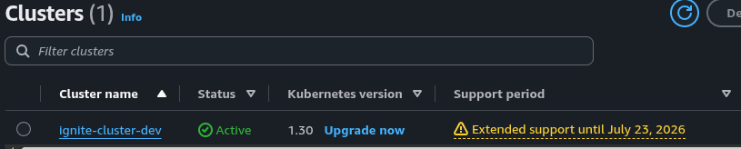
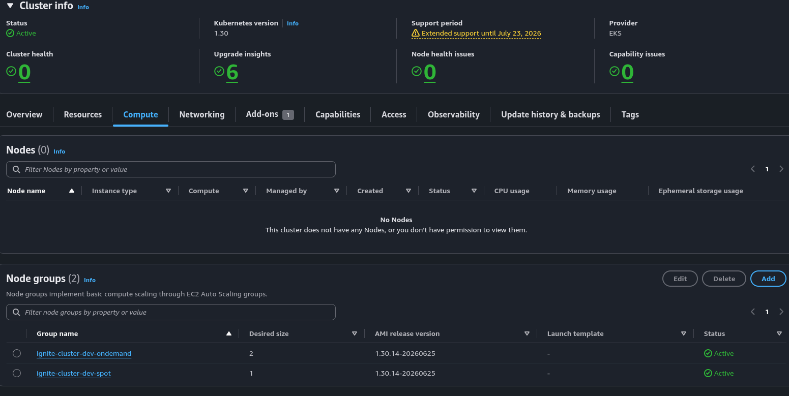
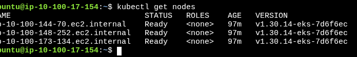
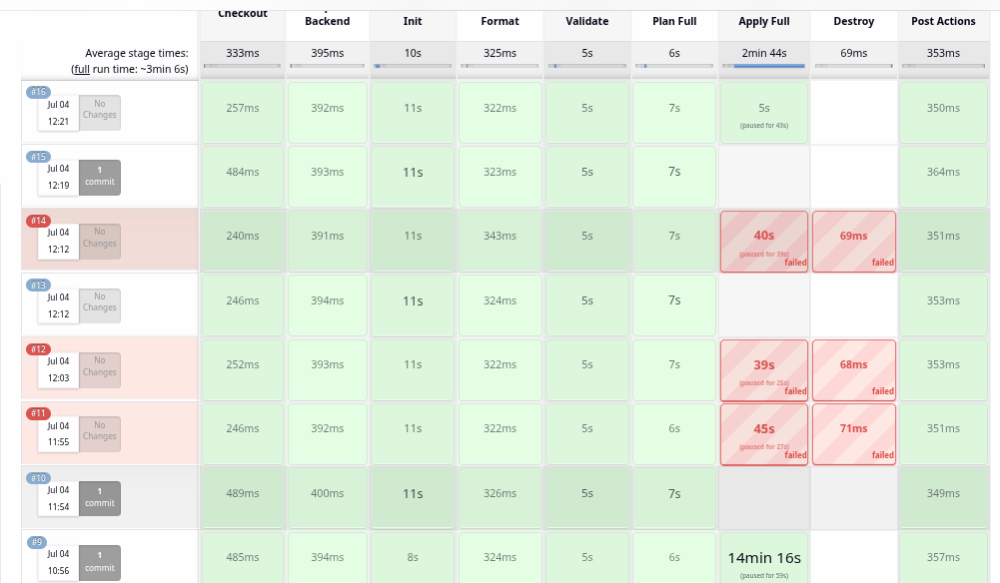

# EKS Infrastructure With Terraform

Production-style AWS EKS infrastructure built with Terraform for the companion 3-tier MERN application.

This repository provisions the cloud foundation: VPC networking, IAM roles, EKS, managed node groups, EKS add-ons, and IRSA support for External Secrets Operator. When enabled, `logging.tf` creates a dedicated Fluent Bit IRSA role and an application CloudWatch log group with 7-day retention.

## What This Project Demonstrates

- Infrastructure as Code with Terraform
- Modular AWS networking, IAM, and EKS design
- Separate `dev` and `prod` environments
- Private EKS API endpoint
- On-demand and spot managed node groups
- EKS OIDC provider and IRSA support
- Scoped Fluent Bit log-writing permissions and Terraform-managed CloudWatch retention
- Jenkins-driven Terraform plan/apply/destroy workflow
- Remote S3 state backend with current DynamoDB locking

## Architecture

```text
AWS us-east-1
|-- VPC
|   |-- Public subnets across 3 AZs
|   |   |-- Internet Gateway
|   |   `-- NAT Gateway
|   `-- Private subnets across 3 AZs
|       `-- EKS managed node groups
|           |-- On-demand nodes
|           `-- Spot nodes
|-- IAM
|   |-- EKS control plane role
|   |-- Node group role
|   |-- IRSA role for External Secrets Operator
|   `-- IRSA role for Fluent Bit (when logging is enabled)
|-- CloudWatch application log group (7-day retention, when enabled)
`-- Remote State
    |-- S3 bucket
    `-- DynamoDB state locking
```

Detailed architecture notes are in [docs/architecture.md](docs/architecture.md).

## Modules

| Module | Purpose |
| --- | --- |
| `modules/vpc` | VPC, public/private subnets, routes, Internet Gateway, NAT Gateway, and EKS security group |
| `modules/iam` | EKS control plane role, node group role, managed policy attachments, and reusable IRSA role support |
| `modules/eks` | EKS cluster, managed node groups, managed add-ons, and OIDC provider |

## Repository Layout

```text
.
|-- environments
|   |-- dev
|   |   |-- backend.tf
|   |   `-- dev.tfvars
|   `-- prod
|       |-- backend.tf
|       `-- prod.tfvars
|-- modules
|   |-- eks
|   |-- iam
|   `-- vpc
|-- .github/workflows
|   `-- terraform.yml
|-- docs
|-- Jenkinsfile
|-- main.tf
|-- logging.tf
|-- ecr.tf
|-- outputs.tf
|-- providers.tf
`-- variables.tf
```

## Prerequisites

- AWS CLI
- Terraform CLI
- kubectl
- Helm
- eksctl
- AWS credentials with permissions for VPC, IAM, EKS, EC2, S3, DynamoDB, and Secrets Manager
- S3 bucket and DynamoDB table for the configured Terraform backend

Terraform does not create the backend bucket/table, jump server, Jenkins/SonarQube host, or MongoDB Secrets Manager values. ECR repositories and EKS access entries can now be managed through opt-in inputs; their default empty/null inputs preserve manual ownership. Provision those prerequisites separately. It creates the External Secrets/Fluent Bit roles, but their Kubernetes controllers and service accounts need post-cluster installation. The companion app's [redeployment checklist](https://github.com/eliyasv/EKS-TF-3tier-app/blob/main/docs/redeployment.md) describes ownership and order.

## Quick Start

Run from the repository root:

```bash
cp environments/dev/backend.tf ./backend.tf
terraform init -reconfigure
terraform fmt -recursive
terraform validate
terraform plan -var-file=environments/dev/dev.tfvars -out=tfplan-dev
terraform apply tfplan-dev
rm -f backend.tf tfplan-dev
```

For prod:

```bash
cp environments/prod/backend.tf ./backend.tf
terraform init -reconfigure
terraform plan -var-file=environments/prod/prod.tfvars -out=tfplan-prod
terraform apply tfplan-prod
rm -f backend.tf tfplan-prod
```

Full environment workflow is in [docs/usage.md](docs/usage.md).

For formatting and validation without AWS credentials or a remote backend, use a separate checkout or temporary directory:

```bash
terraform fmt -check -recursive
terraform init -backend=false -input=false
terraform validate
```

Initialization still needs provider downloads or a populated provider cache. Use the real environment backend for plan/apply/destroy.

## CI/CD

Jenkins is the active CI/CD path for this project. The root [Jenkinsfile](Jenkinsfile) supports:

- `ENVIRONMENT`: `dev` or `prod`
- `ACTION`: `plan`, `apply`, or `destroy`

It copies the selected backend config, initializes Terraform, formats, validates, plans, and optionally applies or destroys infrastructure with manual approval.

The repository also contains a GitHub Actions workflow at `.github/workflows/terraform.yml`, but it is not the current primary deployment path.

CI/CD details are in [docs/ci-cd.md](docs/ci-cd.md).

## Cluster Access

The EKS API endpoint is private by default. Run `kubectl` from a jump server, Jenkins host, or another machine that can reach the VPC.

```bash
aws eks update-kubeconfig --region us-east-1 --name ignite-cluster-dev
kubectl get nodes
```

Access-entry setup is documented in [docs/usage.md](docs/usage.md).

Optional Terraform-managed ECR and EKS access, including adoption/import of existing resources, are documented in [ECR and access](docs/ecr-and-access.md). No dev/prod tfvars are enabled by this change; repository names and application image paths stay the same.

## Required Post-Cluster Add-ons

This Terraform repo provisions the EKS cluster and managed add-ons, but these application-facing controllers are installed after the cluster exists:

- AWS Load Balancer Controller, required for ALB ingress
- Metrics Server, required for HPA
- External Secrets Operator, required for Secrets Manager sync
- Cluster Autoscaler, optional for node scaling

Install notes are in [docs/add-ons.md](docs/add-ons.md).

For the next deployment, an optional [Load Balancer Controller bootstrap](docs/load-balancer-bootstrap.md)
provides Terraform-managed IAM permissions and a pinned Helm installation script.
It is disabled by default; local checks are complete, and live verification is pending.

Argo CD and the Prometheus/Grafana/Alertmanager stack are bootstrapped separately; their configuration is in the companion app repository. For CloudWatch logging, set `infra_enable_cloudwatch_logs = true` with EKS and IRSA enabled (configured for dev), apply the role/log group first, then let Argo CD roll out the app's Fluent Bit configuration. Use the `fluent_bit_irsa_role_arn` and `application_log_group_name` outputs; see the [logging guide](https://github.com/eliyasv/EKS-TF-3tier-app/blob/main/docs/cloudwatch-logging.md).

## Teardown

Follow [the ordered teardown runbook](https://github.com/eliyasv/EKS-TF-3tier-app/blob/main/docs/teardown.md) before the dev destroy workflow. Disable Argo CD automated sync, remove Kubernetes-created load balancers while EKS/controllers still run, and delete workload storage while EBS CSI runs. Check both `aws elb` (Classic) and `aws elbv2` (ALB/NLB).

Remove manually created eksctl resources and handle the jump server and its dedicated security group/EIP. Run the reviewed Terraform destroy from outside the cluster VPC. Preserve the state backend until cleanup is verified, then inventory resources created outside Terraform.

## Proof Of Deployment

| Check | Evidence |
| --- | --- |
| EKS cluster active |  |
| Managed node groups active |  |
| Nodes visible through kubectl |  |
| Jenkins pipeline completed |  |

## Security Notes

This is a learning project with production-style structure. Important security notes:

- Private EKS endpoint is enabled.
- IRSA is used for External Secrets Operator and, when enabled, Fluent Bit.
- Terraform state is stored in S3 with encryption.
- DynamoDB state locking is currently used, though newer Terraform versions recommend native S3 lockfiles.
- Current VPC design uses a single NAT Gateway for cost control; production HA should use one NAT Gateway per AZ.
- If no bastion CIDR or security group is provided, EKS API security group ingress falls back to `0.0.0.0/0` on port 443.

More detail is in [docs/security.md](docs/security.md).
